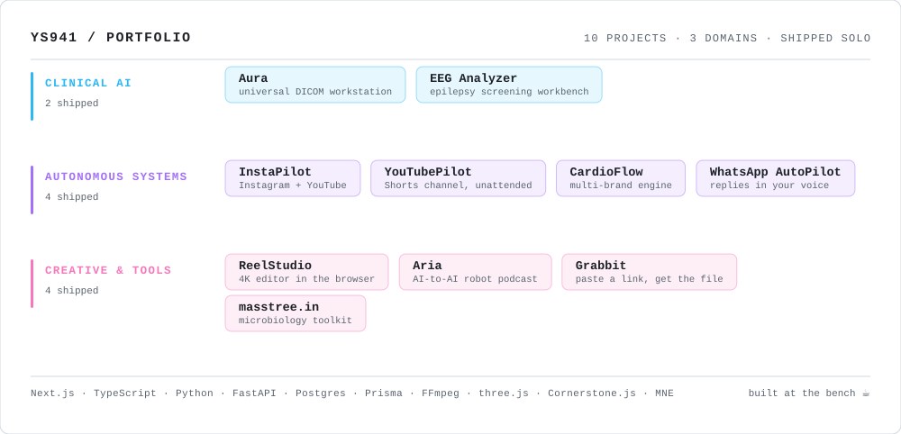

<div align="center">


<a href="https://masstree.in/">
  
</a>

<br /><br />

<p>
  <a href="https://masstree.in/"></a>
  <a href="mailto:ys9410017064@gmail.com"></a>
  <a href="https://github.com/ys941?tab=followers"></a>
  <a href="https://x.com/bhardwaj_yati"></a>
  <a href="https://github.com/ys941?tab=repositories"></a>
  
  
</p>

</div>

<br />

I'm **Yati Bhardwaj** — a self-taught developer who arrived at code from the other side
of the microscope. I build AI products, automation and web apps that run unattended — social
media autopilots, a WhatsApp co-pilot, a browser video editor, clinical imaging tools — ten
of them designed, written and deployed solo, from the first model call to the launcher script. My free lab tools live at **[masstree.in](https://masstree.in/)**
— a QC calculator with the full Westgard multi-rule set, dated control logs and printed reports;
a buffer / serial / molarity dilution calculator; and BioLinguist, a voice-enabled, Hindi-speaking
assistant that works the site for you.

## ▶️ Live demos

Every one of these opens in your browser right now — no install, no sign-up, no keys.

| | Project | What you'll see | |
|:--:|---|---|:--:|
| 🚀 | **InstaPilot AI** | The autonomous Instagram + YouTube Shorts content manager, in demo mode with sample brands | [**Open**](https://ys941.github.io/instapilot-ai/) |
| ▶️ | **YouTubePilot AI** | The faceless Shorts channel worker: topics, scripts, cards, render, schedule | [**Open**](https://ys941.github.io/youtubepilot-ai/) |
| 💬 | **WhatsApp AutoPilot** | The co-pilot dashboard: per-contact style, holds, voice notes, the `@bot` side-channel | [**Open**](https://ys941.github.io/whatsapp-autopilot/) |
| 🎙️ | **Aria** | Two 3D robots perform a podcast written from your topic | [**Open**](https://ys941.github.io/aria/) |
| 🫀 | **Aura Clinical Viewer** | A DICOM workstation in the browser — loads a sample CT study in one click | [**Open**](https://ys941.github.io/aura-clinical-viewer/) |
| ✂️ | **ReelStudio** | A VN-style video editor: multi-track timeline, keyframes, chroma key, 4K export | [**Open**](https://ys941.github.io/reelstudio/) |
| 🎉 | **Project Birthday** | A five-screen animated birthday microsite | [**Open**](https://ys941.github.io/Project-birthday/) |
| 🧮 | **QC Calculator** | Levey-Jennings chart, the full Westgard rule set, dated logs, printed reports | [**Open**](https://masstree.in/tools.html) |
| 💧 | **Dilution Calculator** | Single, serial and molarity dilutions for the bench | [**Open**](https://masstree.in/dilution.html) |
| 🤖 | **BioLinguist** | The site assistant: talk to it, in English or Hindi, and it works the site | [**Open**](https://masstree.in/#BioLinguist) |
| 🌿 | **masstree.in** | The portfolio itself | [**Open**](https://masstree.in/) |

<br />

##  whoami

```yaml
name:        Yati Bhardwaj
role:        software developer · AI, automation & web products  💻
origin:      the lab bench — microbiology, QC, clinical workflows  🔬
focus:       Clinical AI · Autonomous content systems · Browser-native creative tools
approach:    ship end-to-end — model, backend, UI, deploy, and the launcher script
open_to:     remote and part-time work  🌍
debugger:    a second cup of coffee  ☕
fuel_ratio:  60% caffeine · 30% curiosity · 10% pure stubbornness
site:        https://masstree.in
```

I started out at a lab bench — running samples, reading plates, staring at the same
clunky software every shift and thinking *"I could fix that."* Eventually I stopped
thinking it and started writing it.

That gave me an unusual overlap: I know **what a lab and a clinic actually need**, *and*
I can build it myself. So I do — DICOM workstations, EEG screening workbenches, and AI
engines that run entire social channels unattended. No team, no bootcamp, no CS degree:
every project below was designed, built and deployed solo, mostly after hours, entirely
on caffeine.

<br />

<div align="center">

<picture>
  <source media="(prefers-color-scheme: dark)" srcset="assets/map-dark.svg">
  
</picture>

<sub>Ten projects · three domains · all shipped solo — diagram generated by <a href="assets/make_map.py"><code>assets/make_map.py</code></a>, which I also wrote</sub>

</div>

<br />

## 🧰 Tech I build with

<div align="center">

**Frontend**


**Backend · Data · AI**


**Tooling**


<br />


</div>

<br />

---

<div align="center">

# 🩺 Clinical AI

*Where the lab coat and the keyboard finally meet.*

</div>

### 🫀 [Aura — Universal Clinical Viewer](https://github.com/ys941/aura-clinical-viewer)

  

> **One workstation for every scan.** A clinician shouldn't need one tool for a CT, another for a fundus photograph and a third for a scanned report.
>
> **[▶ Open the live demo](https://ys941.github.io/aura-clinical-viewer/)** — loads a sample CT study in one click, entirely in your browser.

<a href="https://ys941.github.io/aura-clinical-viewer/"></a>

Aura opens a bare study file with no extension, a multi-frame series, a **ZIP containing an entire examination** across several folders, or an everyday PNG — all in the same browser viewer, with the same tools. It has **no database and no storage**: a study is decoded locally, worked on, and gone when the tab closes. Nothing is uploaded to be kept, because there is nowhere to keep it.

- 🗂️ Hand it a ZIP of a whole examination and it sorts the contents into **series**, in the right order, with thumbnails and a progress bar
- 🎚️ Viewing presets — soft tissue, angio, lung, bone, brain — applied on open, so a study never arrives washed out
- 📐 Full measurement kit — length, angle, rectangle & ellipse ROIs, point probes, freehand outlines — collected into a list that **flows straight into the report**
- 🧠 AI analysis runs across **every series**, not just the slice you happen to be looking at — and says so plainly when no model is connected rather than inventing a finding
- 📄 Editable structured report with embedded key image and series table → polished document or PDF; cine scrubbing and **animated-GIF export** for presentations
- ⌨️ Reads like a real workstation: corner patient/institution details, orientation letters, live tissue values under the cursor, shortcuts for every tool

<sub>`Next.js` `TypeScript` `Cornerstone.js` `MedGemma` · <b>source public</b> · MIT · ⚕️ *research prototype — not a medical device*</sub>

<br />

### 🧠 [EEG Epilepsy Analyzer](https://github.com/ys941/eeg-epilepsy-analyzer-showcase)

 

> **An EEG you can't scrub is an EEG you can't read.**

An end-to-end screening workbench: drop in a standard recording and it opens the montage as an interactive multi-channel trace, measures the rhythms clinicians actually look at, runs an epileptiform screening pass — then turns all of it into something *readable* instead of a wall of numbers. Plenty of tools will hand you a spectrum; very few will explain what they saw.

- 📈 Pan across the recording, zoom into a suspicious second, isolate a single channel, inspect any window
- 🌊 Per-channel breakdown across the classical frequency bands — the quantities a reader would reach for, made explicit
- 🎯 Automated epileptiform check, deliberately framed as **a prompt to look closer, never a diagnosis**
- 🧾 Plain-language narrative report grounded in the numbers actually extracted, exported as a properly typeset PDF with every channel label rendering correctly
- 🔑 Self-hosted with your own credentials and a one-click launcher — recordings don't go to anyone else's product

<sub>`FastAPI` `React` `MNE` `Plotly` · ⚕️ *research & educational tool*</sub>

<br />

---

<div align="center">

# 🤖 Autonomous AI Systems

*Set the niche. Walk away. It keeps posting.*

</div>

### 🚀 [InstaPilot AI](https://github.com/ys941/instapilot-ai) — a whole content team for Instagram **+** YouTube

  

> **One AI brain. Two platforms. Zero daily effort.**

Running a serious Instagram *and* YouTube presence is two full-time jobs — ideate, write, design, render, schedule, cross-post, then answer every comment and DM, forever. InstaPilot collapses all of it into one self-hosted app running on accounts that are entirely yours.

- 🪄 **AI Setup** — describe your brand in one sentence; it asks whatever it still needs, then generates the entire configuration (niche, persona, handles, labels, topics, schedule) for you to review and apply
- 🎬 Invents topics that don't repeat, writes hook/body/CTA/hashtags, designs branded cards and carousels, builds **15–60s vertical Shorts** with mood-matched music
- 🎙️ Optional AI voiceover **synced per card** over auto-ducked music, with captions that **auto-translate into each viewer's language** — or burn in word-by-word
- 🔁 Turns a Short into an Instagram Reel automatically, on its own deferred schedule
- 💬 Replies to comments and DMs — including **voice notes, listened to and answered aloud** — and is smart enough never to reply to itself
- 🛡️ Won't publish twice, won't talk over itself, recovers on its own after an interruption; every model has backups so one bad day upstream never costs a day of posting

<sub>`Next.js` `TypeScript` `Prisma` `Graph API` `n8n` `ffmpeg` · 🎨 white-label · 🏢 multi-brand · 🔑 self-hosted</sub>

<br />

### ▶️ [YouTubePilot AI](https://github.com/ys941/youtubepilot-ai) — a faceless worker that runs a Shorts channel

  

> **Idea → script → video → upload → engage. Fully unattended.**

One app replacing your writer, designer, video editor and community manager. It runs the daily grind on a schedule you set, in a niche and voice you choose, on a channel that's 100% yours.

- 🎬 Real videos, not slideshows — a curiosity **hook cover → large-text content slides → subscribe outro**, one cohesive colour theme per Short, length selectable 15–60s
- 🏷️ Writes the rich description, generates search tags and a custom thumbnail, then seeds an engagement-bait **first comment** on upload
- 🎙️ Six AI voices, narration synced to each card over ducked music, auto-translated or TikTok-style word-by-word captions
- 🧪 When your topic list runs dry it generates fresh same-style ideas, with quality-gated titles and no rerunning yesterday's subject
- 🏢 Many channels from one dashboard, each with its own brand, schedule and topics — plus **10 dashboard themes** and full re-skinning from the Settings UI
- 📊 Syncs analytics and emails you a daily health digest

<sub>`Next.js` `TypeScript` `Prisma` `FFmpeg` `TTS` · 🎨 white-label · 📲 installable · 🔑 your keys, your channel</sub>

<br />

### 💓 CardioFlow AI — the production build, tuned for medical education

 

> The engine that started as a single-account tool and grew into a **multi-brand platform**.

Each brand is a paired Instagram + YouTube account running the full pipeline independently — own configuration, prompts, topics, schedule and accounts. A human mostly just watches the dashboard.

- 📚 Many formats, one voice — educational posts, clinical pearls, prevention tips, **quizzes where the answer never leaks in-feed**, myth-vs-fact, case studies, carousels and Stories
- 🧠 Topics are tracked and rotated so the generator avoids repeating the *subject* of recent posts, not merely the wording
- 📅 **Per-weekday** scheduling for both platforms, each day with its own post count and times, timezone-aware
- 🌐 Replies come back in whatever language the sender used — English, Hindi in Devanagari, or romanised Hinglish — phrased natively rather than translated
- 🛡️ Inbound messages are treated as **untrusted**, so instructions hidden in a DM can't hijack a reply; the bot never diagnoses and always defers to the person's own clinician
- 📊 A Morning Digest you choose the sections of, with numbers pulled **live at send time** — and health reporting that reflects what's actually happening, not merely whether an API key exists

<sub>`Next.js` `Prisma` `Postgres` `Grok` `Gemini` `ffmpeg` `Railway` · 🎨 ten-theme design system · 📲 installable dashboard</sub>

<br />

---

<div align="center">

# 🎬 Creative & Everyday Tools

*Things I wanted to exist, so I built them.*

</div>

### ✂️ [ReelStudio](https://github.com/ys941/reelstudio) — a real video editor that never uploads your footage

 

> **A full VN-style editor running entirely in the browser.** No installs, no uploads, 100% client-side.
>
> **[▶ Try the live demo](https://ys941.github.io/reelstudio/)** — opens straight in your browser.

<a href="https://ys941.github.io/reelstudio/"></a>

- 🧱 Multi-track timeline with drag across tracks, trim, split, duplicate, snapping and zoom — plus a live canvas preview with on-stage drag / scale / rotate handles
- 🎞️ **Keyframes** for position, scale, rotation and opacity; 0.1×–4× speed ramping; 8 transitions (fade, dissolve, slide, wipe, zoom, blur, glitch, whip)
- 🎨 10 filter presets plus brightness, contrast, saturation, exposure, temperature, tint, highlights, shadows, blur, vignette, grain and hue
- 🟢 **Chroma key** with similarity, smoothness and spill controls; picture-in-picture overlays with blend modes; text/image **watermarks** with 9 positions and tiling, burned into exports
- 🎙️ Record a voiceover straight from your mic onto the timeline, extract a clip's audio into its own track, mix per-clip volume and fades in real time
- ⬇️ **In-browser export up to 4K** — MP4 / WebM with mixed audio (GIF via FFmpeg.wasm), 360p→2160p with resolution-aware bitrate

<sub>`Next.js 14` `React 18` `TypeScript` `Zustand` `Canvas` `FFmpeg.wasm` ·  **source public**</sub>

<br />

### 💬 [WhatsApp AutoPilot](https://github.com/ys941/whatsapp-autopilot) — a co-pilot that texts like *you*

  

> The point isn't "an AI answers your WhatsApp." The point is that the replies read like **you** wrote them.

Auto-reply is **off by default and opt-in per contact** — a master switch *plus* a per-chat toggle — so it never speaks for you to someone you didn't authorise.

- 🧬 Studies how you actually text *this particular person* — your rhythm, slang, sentence length, Hinglish — into a lasting per-contact style profile. No assistant-speak, ever
- 🧠 A one-time deep read of your history captures the relationship, recurring facts and running plans, so replies arrive with context
- 🔔 Flags the messages that genuinely need *you* — plans, money, confirmations, "are you okay" — and can **hold them back** from auto-sending. A hard rule stops it committing to times or meetings on your behalf
- 🎙️ Voice notes both ways: incoming ones transcribed, replies sent as a **real WhatsApp voice note**. It reads images, PDFs and shared links too
- 💤 Waits out a rapid volley of five messages and sends **one** considered reply — and catches a near-duplicate of its own last replies before it can go out
- 💡 An **`@bot` side-channel**: a correction gets phrased properly and sent for you; a question gets answered privately inline, visible to nobody else
- 🔒 Access-key locked (no key = *no data at all*), write-only secrets, and OTPs / bank alerts recognised, never stored, never answered

<sub>`Next.js` `Socket.IO` `whatsapp-web.js` `Groq` `Gemini vision` · 🗣️ Hinglish-native · 📲 installable</sub>

<br />

### 🎙️ [Aria](https://github.com/ys941/aria) — an AI-to-AI podcast hosted by 3D robots

> Pick a topic. Two robots take the mic. **Neither of them knew what they were going to say.** 
>
> **[▶ Tune in to the live demo](https://ys941.github.io/aria/)** — Reachy FM and the 3D robots, right in your browser.

Type *"why pineapple belongs on pizza"* and an episode is written from nothing — cast invented to fit the subject, roughly two dozen lines — then voiced line by line and streamed to your browser, where two robot hosts perform it. From a blank field to two robots arguing: about a minute.

- 🗣️ Distinct voices per host, subtitles colour-coded to whoever's talking, and a level meter that moves with the audio
- 🤖 A wizard for your own host — name, personality, voice — ending in a **live 3D twin** of the robot you just built
- 🎓 **English practice mode**: a coach, a learner and a guide. The learner slips up, the coach corrects and explains, the guide offers a more natural phrasing, the learner tries again
- 🎨 Fifteen themes with ambient atmosphere — drifting petals, floating embers, slow stars — that quietens itself under reduce-motion
- 🔁 If one engine is unavailable or rate-limited the next picks it up **mid-episode**. You hear a podcast, not an error message

<sub>`three.js` `FastAPI` `LiveKit` `Modal` `multi-engine TTS` · <b>source public</b> · MIT</sub>

<br />

### 🐇 [Grabbit](https://github.com/ys941/grabbit-downloader-showcase) — paste a link, get the file

 

> Every download site on the open web is a minefield of pop-ups, fake buttons and mystery redirects. This is the version you'd actually want: **one page, one field, one file.**

- 🏷️ Your download is named **after the video** — spaces, accents and all — not `video_dQw4w9WgXcQ.mp4`
- 🔗 Queue as many links as you like; each saves as its own file with a live "downloading 3 of 7" counter — no archive to unzip
- 🍏 Delivered in a format Apple devices can actually open: **compatibility wins over a bigger resolution number**
- 🎧 Rip audio on its own at 320 kbps MP3, or keep the original track untouched
- 🤖 Works through alternative routes automatically when a video is awkward — and fails fast in a couple of seconds on a private, deleted or over-long one
- 🔒 Full-screen access-key lock (change the key and every device signs out instantly), installable to your home screen, and engineered to fit a **512 MB free tier**

<sub>`Flask` `yt-dlp` `ffmpeg` `Railway` · deployed, live, and used daily</sub>

<br />

---

<div align="center">

## ✨ Also on the shelf

</div>

| | Project | What it is |
|:--:|---|---|
| 🌿 | **[masstree.in](https://masstree.in/)** | My portfolio and a **lab toolkit**: a QC calculator with the full Westgard multi-rule set (dated entries, target mean/SD, saved runs, a designed printed report), a dilution calculator (single, serial, molarity), and *BioLinguist* — an assistant that answers by voice, understands Hindi and Hinglish, and works the site (opens tools, runs the calculators, drafts the contact form). Plus *RoastBot*, which does not explain anything properly. Static HTML + PHP, prompts and keys kept server-side. |
| 🎉 | **[Project Birthday](https://github.com/ys941/Project-birthday)** | A five-screen interactive birthday site built as a gift — animated transitions, particle effects and a little narrative. Proof that not everything has to be a SaaS. |
| 🧪 | **[Kaggle — Qwen3-8B dual RAG](https://www.kaggle.com/yatibhardwaj123)** | One 8B GGUF model serving **two** retrieval-augmented personas from the same weights: a cath-lab clinical assistant and a casual chat persona. |

<br />

### All public repositories

Every project above in one plain list — no images, no badges, just links.

- [aura-clinical-viewer](https://github.com/ys941/aura-clinical-viewer) — browser DICOM workstation with AI analysis
- [instapilot-ai](https://github.com/ys941/instapilot-ai) — autonomous Instagram + YouTube Shorts content manager
- [youtubepilot-ai](https://github.com/ys941/youtubepilot-ai) — faceless worker running a YouTube Shorts channel
- [whatsapp-autopilot](https://github.com/ys941/whatsapp-autopilot) — WhatsApp co-pilot that replies in your own voice
- [aria](https://github.com/ys941/aria) — AI-to-AI podcast hosted by 3D robots
- [reelstudio](https://github.com/ys941/reelstudio) — VN-style video editor running entirely in the browser
- [eeg-epilepsy-analyzer-showcase](https://github.com/ys941/eeg-epilepsy-analyzer-showcase) — EDF screening workbench for EEG
- [grabbit-downloader-showcase](https://github.com/ys941/grabbit-downloader-showcase) — self-hosted Reels and YouTube downloader
- [Project-birthday](https://github.com/ys941/Project-birthday) — animated five-screen birthday microsite
- [ys941](https://github.com/ys941/ys941) — this profile README

Built by **Yati Bhardwaj** · [masstree.in](https://masstree.in/) · New Delhi, India

<br />

---

<div align="center">

## 🔭 Currently

Turning the **masstree.in QC calculator** into a proper bench tool — dated control logs,
target mean/SD, the full Westgard rule set and printed reports — alongside better study
handling in **Aura** and a sharper screening pass in the **EEG Analyzer**, while the
autopilots keep posting on their own.

<br />

## 🤝 Let's build something

A self-taught developer with a lab scientist's eye for what people actually need. Open to
**remote and part-time work** across AI products, automation and web development — healthcare
included, but far from only — and always happy to talk shop (or coffee) about anything above.

<a href="mailto:ys9410017064@gmail.com"></a>
<a href="https://masstree.in/"></a>
<a href="https://github.com/ys941"></a>
<a href="https://x.com/bhardwaj_yati"></a>

<br /><br />

If something here is useful to you, a ⭐ on the repo or a **[follow](https://github.com/ys941)** is how I find out — it genuinely decides what I build next.

<br /><br />

> *"Isolate the problem. Culture a fix. Ship the cure."*
>
> — still the same job, just a different bench ☕


</div>
